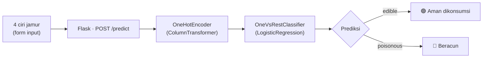

<div align="center">

#  MycoLab

### Klasifikasi Jamur *Edible* vs *Poisonous* dengan Machine Learning

Web app Flask yang memprediksi keamanan konsumsi jamur dari 4 ciri fisik,
memakai model klasifikasi yang dilatih di atas dataset UCI Mushroom (8.124 spesimen).

<p>
  
  
  
  
</p>

<p>
  <a href="#-preview">Preview</a> ·
  <a href="#-fitur">Fitur</a> ·
  <a href="#-cara-kerja-model">Cara Kerja Model</a> ·
  <a href="#-instalasi">Instalasi</a> ·
  <a href="#-api">API</a> ·
  <a href="#-disclaimer">Disclaimer</a>
</p>

</div>

<br>

##  Tentang Proyek

**MycoLab** adalah antarmuka web untuk model klasifikasi jamur yang dibangun
sebagai bagian dari latihan *machine learning* klasik (`Part_7_-_Latihan.ipynb`).
Alih-alih cuma menampilkan angka akurasi di notebook, proyek ini membungkus
modelnya jadi tools yang bisa dipakai siapa pun lewat browser — pilih ciri fisik
jamur yang ditemukan, dan model akan memprediksi apakah aman dikonsumsi.

Tema visualnya terinspirasi teknik **spore print** asli yang dipakai mikolog
untuk identifikasi jamur: menjejakkan tudung jamur di atas kertas semalaman
untuk melihat pola & warna sporanya. Elemen ini jadi visualisasi utama hasil
prediksi — sebuah "rosette" titik-titik yang mekar hijau (aman) atau merah
(beracun) sesuai hasil analisis.

##  Fitur

-  **Prediksi real-time** — kirim 4 ciri jamur, dapat hasil klasifikasi + skor keyakinan tanpa reload halaman (fetch API)
-  **Visualisasi spore-print rosette** — SVG dinamis yang beranimasi sesuai hasil prediksi
-  **Confidence bar** untuk kedua kelas (*edible* & *poisonous*), bukan cuma label biner
-  **Auto-train saat pertama kali dijalankan** — model dilatih otomatis di environment lokal, jadi tidak ada masalah kompatibilitas pickle lintas versi scikit-learn
-  **Desain gelap khas "lab mikologi"** — palet forest-floor + tinta cetakan spora, tipografi Instrument Serif × IBM Plex Mono
-  **Responsif** — layout dua kolom di desktop, satu kolom di mobile

##  Preview

<div align="center">
  <!-- Ganti dengan screenshot/GIF asli kamu, contoh: -->
  <!--  -->
</div>

>  Rekam GIF singkat alur: pilih 4 ciri → klik **"Analisis Spesimen"** → rosette
> mekar hijau/merah. Simpan sebagai `docs/demo.gif`, lalu tambahkan baris ini
> tepat di atas blockquote ini:
> ```md
> 
> ```

##  Cara Kerja Model

### Fitur yang digunakan

Dari 22 kolom kategorik di dataset, 4 fitur dengan korelasi terkuat terhadap
target dipilih lewat *association matrix*:

| Fitur | Deskripsi | Contoh Nilai |
|---|---|---|
| `odor` | Aroma tudung/batang jamur | almond, foul, musty, none |
| `gill_color` | Warna insang (bilah di bawah tudung) | white, brown, buff |
| `ring_type` | Bentuk cincin pada batang | pendant, evanescent, none |
| `spore_print_color` | Warna jejak spora di kertas | black, brown, chocolate |

### Pipeline



### Hasil evaluasi

Dievaluasi dengan `train_test_split` 80/20 (`random_state=42`) + `GridSearchCV`
(cv=3) untuk tuning `C` dan `fit_intercept`:

| Metrik | Skor |
|---|---|
| Akurasi data latih | 99.49% |
| Akurasi CV terbaik | 99.45% |
| **Akurasi data uji** | **99.32%** |
| ROC AUC | 0.9998 |
| Precision (edible) | 98.71% |
| Recall (edible) | 100% |

> Dataset: 8.124 spesimen (4.208 edible / 3.916 poisonous) dari UCI Mushroom
> Dataset — kelas-kelasnya terpisah sangat rapi secara statistik, sehingga
> akurasi setinggi ini wajar untuk data ini.

##  Tech Stack

| Layer | Teknologi |
|---|---|
| Backend | Flask |
| Model | scikit-learn (`OneVsRestClassifier` + `LogisticRegression`) |
| Data | pandas |
| Frontend | HTML5, CSS3 (custom, tanpa framework), vanilla JS |
| Visualisasi hasil | SVG dinamis (spore-print rosette) |

##  Instalasi

```bash
git clone https://github.com/rizki-putra-saimona-armen/mycolab.git
cd mycolab
pip install -r requirements.txt
python app.py
```

Buka `http://127.0.0.1:5000` di browser.

>  Run pertama makan waktu ~5-10 detik karena model dilatih otomatis dari
> `data/mushrooms.csv` memakai scikit-learn yang terpasang di komputermu, lalu
> disimpan ke `model/`. Run berikutnya instan. Model **sengaja tidak** ikut
> di-commit ke repo supaya tidak ada isu kompatibilitas pickle lintas environment.

##  Deploy ke Vercel

Proyek ini sudah kompatibel untuk deploy langsung ke Vercel (deteksi Flask
otomatis lewat `requirements.txt` + entrypoint `app.py`):

```bash
npm install -g vercel
vercel
```

Beberapa hal yang sudah disesuaikan khusus untuk Vercel:

- **Filesystem read-only.** Serverless function Vercel tidak bisa menulis
  file di luar `/tmp`. Karena itu `app.py` melatih model **di memori** saat
  cold start, dan penyimpanan ke `model/*.pkl` sifatnya cuma cache
  best-effort — kalau gagal ditulis, app tetap jalan normal (cuma berarti
  tiap cold start baru akan melatih ulang, ~5 detik).
- **Static assets di `public/`**, bukan `static/` bawaan Flask — mengikuti
  konvensi Vercel supaya CSS/JS dilayani lewat CDN.
- **`n_jobs=1`** pada `GridSearchCV` (bukan `-1`) supaya tidak bergantung pada
  multiprocessing, yang sering dibatasi di sandbox serverless.
- `vercel.json` menaikkan `maxDuration` jadi 30 detik untuk memberi buffer di
  cold start pertama.

>  Kalau mau cold start lebih instan, kamu bisa commit `model/mushroom_model.pkl`
> hasil training lokal ke repo (pastikan versi scikit-learn di `requirements.txt`
> persis sama dengan yang dipakai saat training) — app akan otomatis memakainya
> tanpa training ulang selama smoke-test-nya lolos.

##  Struktur Proyek

```
mycolab/
├── app.py                 # Flask app + endpoint /predict + auto-train saat startup
├── train_model.py          # build_and_fit() (murni) + train_and_save() (CLI/cache lokal)
├── requirements.txt
├── vercel.json              # config deploy Vercel (maxDuration)
├── data/
│   └── mushrooms.csv
├── model/                  # dibuat otomatis saat run pertama (tidak di-commit)
│   ├── mushroom_model.pkl
│   └── metadata.json
├── templates/
│   └── index.html
└── public/                 # aset statis (konvensi Vercel)
    ├── css/style.css
    └── js/script.js        # bangun rosette SVG + panggil /predict via fetch
```

##  API

### `POST /predict`

**Request body**

```json
{
  "odor": "almond",
  "gill_color": "white",
  "ring_type": "pendant",
  "spore_print_color": "brown"
}
```

**Response `200`**

```json
{
  "prediction": "edible",
  "confidence": 99.64,
  "proba_edible": 99.64,
  "proba_poisonous": 0.36,
  "input": {
    "odor": "Almond",
    "gill_color": "Putih",
    "ring_type": "Menggantung",
    "spore_print_color": "Cokelat"
  }
}
```

**Response `400`** — data tidak lengkap

```json
{ "error": "Data belum lengkap: gill_color, ring_type, spore_print_color" }
```

##  Disclaimer

Proyek ini dibuat untuk tujuan pembelajaran *machine learning* & pengembangan
web, **bukan** alat identifikasi jamur yang aman dipakai di lapangan. Jangan
jadikan prediksi model ini sebagai satu-satunya acuan sebelum mengonsumsi
jamur liar — selalu konsultasikan ke ahli mikologi.


[](https://github.com/rizki-putra-saimona-armen)

<div align="center">
<sub>🍄 Dibangun sebagai bagian dari seri latihan machine learning & deep learning.</sub>
</div>
